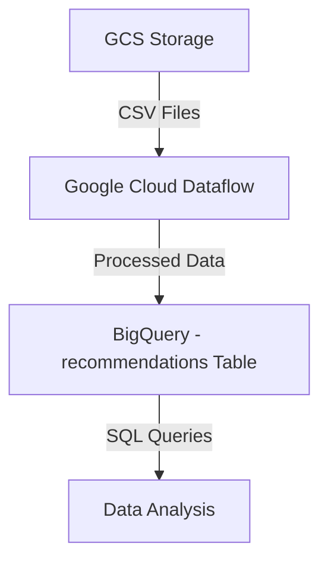

# Google Cloud Dataflow Pipeline for Matching Suppliers with Buyer Preferences

## **Task 3**
### **Objective:** Match supplier materials to buyer preferences and create a recommendation table.
- **Tools:** Use a desired database of your choice.
- **Task:** Create a data pipeline that:
  - Joins the supplier data with buyer preferences.
  - Identifies materials that match buyer preferences based on criteria like grade, finish, and thickness.
  - Outputs a table that lists recommended materials for each buyer.

---

## 📌 **Overview of the Pipeline and GCP Services Used**
This project automates the process of matching **supplier materials** with **buyer preferences** using **Google Cloud Dataflow** and **BigQuery**.

✔ Reads supplier and buyer data from **Google Cloud Storage (GCS)**  
✔ Matches supplier materials to buyer preferences  
✔ Stores the recommendations in **BigQuery** dataset as `recommendations`.  

---

## 🚀 **Prerequisites to Make This Pipeline**
### **1️⃣ Set Up Google Cloud Environment**
Ensure you have:
- **Google Cloud SDK Installed**: Use the command below to install it. This will provide a separate link on Google Cloud Shell. Ensure that you have enabled APIs for Google Cloud Shell.
```sh
gcloud services enable dataflow.googleapis.com bigquery.googleapis.com storage.googleapis.com
gcloud auth login
```
- **GCP Project:** Check the project name `vanilla-steel-task-2`

### **2️⃣ Enable Required GCP Services** using the above command.

---

## 🔄 **Step 1: Upload Files to Google Cloud Storage (GCS)**
The necessary files have already been uploaded to the bucket.

📸 **Snapshot:**  


### **1️⃣ Verify Again If Files Exist** (Run this in Cloud Shell)
```sh
gsutil ls gs://vanila_steel_task_2/resources/task_3/
```
✔ Expected output:
```
gs://vanila_steel_task_2/resources/task_3/buyer_preferences.csv
gs://vanila_steel_task_2/resources/task_3/supplier_data1.csv
gs://vanila_steel_task_2/resources/task_3/supplier_data2.csv
```

---

## 🛠 **Step 2: Create BigQuery Dataset & Table**
### **1️⃣ Create a BigQuery Dataset**
```sh
bq mk --location=US vanila_steel_dataset_1
```

### **2️⃣ Create a BigQuery Table** (Check data types before proceeding)
```sh
bq query --use_legacy_sql=false \
'CREATE TABLE vanila_steel_dataset_1.recommendations (
   buyer_id STRING,
   supplier_id STRING,
   material_type STRING,
   price FLOAT64,
   availability STRING
);'
```

---

## 🏗 **Building the Data Pipeline**
The Python script **`ingestion.py`** is developed in **Visual Studio Code** and is attached below:

```python
import apache_beam as beam
from apache_beam.options.pipeline_options import PipelineOptions
import csv
import io
import pandas as pd
from google.cloud import storage, bigquery

# GCP Configurations
PROJECT_ID = "vanilla-steel-task-2"
BUCKET_NAME = "vanila_steel_task_2"
DATASET_ID = "vanila_steel_dataset_1"
TABLE_ID = "recommendations"

# GCS file paths
BUYER_PREFERENCES_FILE = f"gs://{BUCKET_NAME}/resources/task_3/buyer_preferences.csv"
SUPPLIER_DATA1_FILE = f"gs://{BUCKET_NAME}/resources/task_3/supplier_data1.csv"
SUPPLIER_DATA2_FILE = f"gs://{BUCKET_NAME}/resources/task_3/supplier_data2.csv"

class ReadCSVFile(beam.DoFn):
    def __init__(self, file_path):
        self.file_path = file_path

    def process(self, element):
        client = storage.Client()
        bucket = client.bucket(BUCKET_NAME)
        blob = bucket.blob(self.file_path.split("/")[-1])
        content = blob.download_as_text()
        reader = csv.DictReader(io.StringIO(content))
        return [row for row in reader]

class MatchSupplierWithBuyer(beam.DoFn):
    def process(self, element):
        buyer_data, supplier_data = element
        buyer_df = pd.DataFrame(buyer_data)
        supplier_df = pd.DataFrame(supplier_data)
        buyer_df.columns = buyer_df.columns.str.lower().str.replace(" ", "_")
        supplier_df.columns = supplier_df.columns.str.lower().str.replace(" ", "_")
        merged_df = buyer_df.merge(supplier_df, on='material_type', how='inner')
        recommendations = merged_df[["buyer_id", "supplier_id", "material_type", "price", "availability"]]
        return recommendations.to_dict(orient="records")

class WriteToBigQuery(beam.DoFn):
    def process(self, element):
        client = bigquery.Client()
        table_ref = f"{PROJECT_ID}.{DATASET_ID}.{TABLE_ID}"
        job = client.insert_rows_json(table_ref, [element])
        if job:
            print(f"Error inserting row: {job}")
        return

def run():
    options = PipelineOptions(
        runner="DataflowRunner",
        project=PROJECT_ID,
        temp_location=f"gs://{BUCKET_NAME}/resources/task_3/temp",
        region="us-central1",
        staging_location=f"gs://{BUCKET_NAME}/resources/task_3/staging"
    )

    with beam.Pipeline(options=options) as p:
        buyer_prefs = p | "Read Buyer Preferences" >> beam.ParDo(ReadCSVFile(BUYER_PREFERENCES_FILE))
        supplier_data1 = p | "Read Supplier Data 1" >> beam.ParDo(ReadCSVFile(SUPPLIER_DATA1_FILE))
        supplier_data2 = p | "Read Supplier Data 2" >> beam.ParDo(ReadCSVFile(SUPPLIER_DATA2_FILE))
        supplier_data = (supplier_data1, supplier_data2) | beam.Flatten()
        recommendations = ((buyer_prefs, supplier_data) | "Match Suppliers with Buyers" >> beam.ParDo(MatchSupplierWithBuyer()))
        recommendations | "Write to BigQuery" >> beam.ParDo(WriteToBigQuery())

if __name__ == "__main__":
    run()
```

---

## **Architecture Diagram**


This completes the pipeline setup!

Now check the dataset in bigquery and check the recommendation table within the project.
